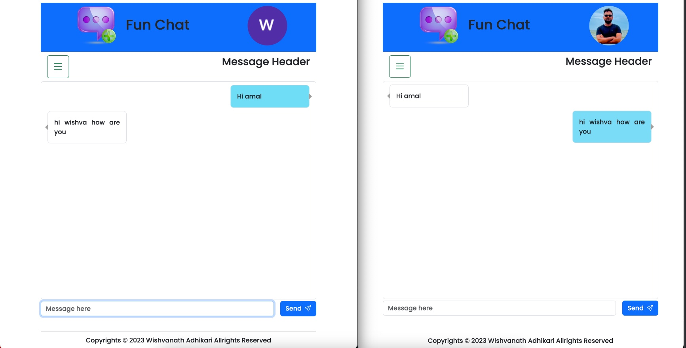

# Fun Chat

Introducing "Fun-Chat" – a cutting-edge chat application designed to revolutionize your communication experience. With a robust back end powered by the Spring framework and WebSocket technology, Fun Chat Connect ensures real-time, seamless conversations.

Our Spring framework backend guarantees scalability, reliability, and efficient data handling, providing a stable foundation for your messaging needs. Leveraging the power of WebSockets, users can enjoy instant message delivery and dynamic updates, creating an immersive and responsive chatting environment.

On the frontend, we've utilized Parcel for streamlined project bundling, while HTML, CSS, and JavaScript work harmoniously to deliver a clean and user-friendly interface. ChatHub Connect is not just a messaging platform; it's a personalized space for connecting with friends, family, and colleagues effortlessly.

Experience the future of communication with ChatHub Connect – where innovation meets simplicity, and every message matters.

## VERSION
0.3.0

## Screenshots

### License
Copyrights &copy; 2023 Wishvanath Adhikari All rights Reserved 
This is Licensed Under [MIT License](License.txt)
